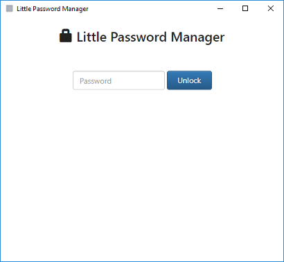
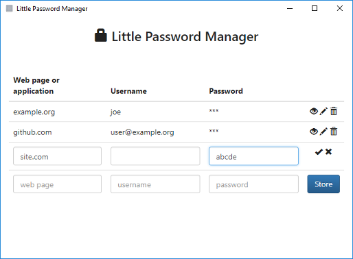

# Little Password Manager
  

### About

This application let's you store your passwords in one place and protect them from unauthorized access. Passwords are stored in a single encrypted json file.

### Installation and running

1. install [Node.js](https://nodejs.org/)
2. download this repository to a directory
3. run `npm ci` to install dependencies
3. run `npm run build` to build project files
4. use `npm start` to run the app (to start without console at windows dblclick on `windows.vbs`)

### Screenshots

### License

LPM is available under the [MIT license](LICENSE)
